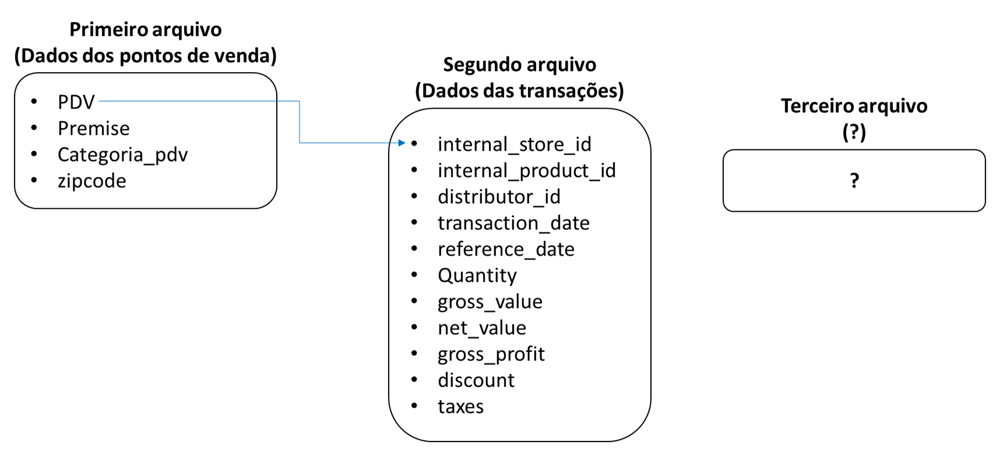

# Brainstorm de Ideias

## Diagrama resumido

## Primeiro arquivo (tid-2779033056155408584-f6316110-4c9a-4061-ae48-69b77c7c8c36-4)

- **PDV:** Tentar "enxugar" os ids. Verificar se não há uma correlação entre o id e as características dos dados. As recorrências desses índices também devem ser alteradas.

- **Premise:** Entender do que se trata.

- **categoria_pdv:** Avaliar viabilidade de _One-hot encoding_

- **zipcode:**
  - Verificar se faz sentido fornecer mais informações de cada zip code (caso sejam zip codes válidos) para aumentar o número de informações disponíveis para treino
  - Se fizer sentido, avaliar como extrair essas informações da internet e incorporá-las nos dados

## Segundo arquivo (tid-5196563791502273604-c90d3a24-52f2-4955-b4ec-fb143aae74d8-4)

- **internal_store_id:**

  - Avaliar a correlação com o primeiro arquivo. Há índices distintos, o que pode implicar em removê-los do treino ou simplesmente ignorá-los.
  - Tentar "enxugar" os IDs conforme **PDV** do primeiro arquivo.

- **internal_product_id:** Tentar "enxugar" os IDs conforme **PDV** do primeiro arquivo.

- **transaction_date e reference_date:** Avaliar mudar as datas para números (mais simples de armazenar). Entender qual é a relação entre esses dois dados.

- **quantity, gross_value, net_value, gross_profit:** Entender o que representam, pois existem números negativos. Entender também as correlações.

- **discount e taxes:** Ambos apresentam valores sem sentido. Entender os dados

## Terceiro arquivo (tid-6364321654468257203-dc13a5d6-36ae-48c6-a018-37d8cfe34cf6-263)

- Tentar extrair o arquivo (grande!) no colab. **Rangel tentará fazer isso (10-09-25)**

## Entendendo os dados

- Queremos prever vendas futuras a partir das vendas passadas. Devemos supor que há padrões temporais que queremos capturar.

- É interessante adicionar features nos dados (informações adicionais sobre as datas das vendas, como feriados, o dia da semana etc)

- Algumas features importantes já foram disponibilizadas (categoria dos produtos, das lojas etc)

## Arquiteturas
- Pelo número de features, abordagens clássicas de *Machine Learning* podem não ser as melhores, apesar de serem mais rápidas. Além disso, existem redes neurais profundas especializadas em dependências temporais:

  - **RNN - Recurrent Neural Network:**  Elas têm uma memória interna que lida com dados em ordem, permitindo que a saída de uma etapa influencie a entrada da próxima. Isso as torna ideais para tarefas onde a ordem dos dados é crucial, como texto e séries temporais.
  - **LSTM - Long Short-Term Memory:** é uma variação da RNN projetada para superar o problema do "gradiente evanescente", que dificulta o aprendizado de dependências de longo prazo. Ela possui uma estrutura interna mais complexa, com "portões" (gates) que controlam o fluxo de informações, permitindo que a rede se lembre de dados importantes por períodos mais longos e ignore informações irrelevantes.
  - **N-BEATS:** é uma arquitetura moderna e robusta projetada especificamente para previsão de séries temporais. Diferente das RNNs, ela é composta por pilhas de redes totalmente conectadas (fully connected networks) que usam uma abordagem de "backcast" e "forecast". Essa estrutura permite modelar e decompor os dados em seus componentes de tendência e sazonalidade, tornando-a mais precisa e, em alguns casos, interpretável. **Rangel tentará implementar essa daqui**

